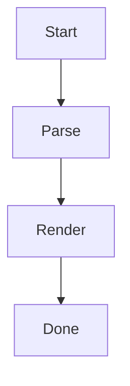

# Heading 1
## Heading 2
### Heading 3
#### Heading 4
##### Heading 5
###### Heading 6

- **This is bold text**
- _This text is italicized_
- ~~This was mistaken text~~
- **This text is _extremely_ important**
- ***All this text is important***
- This is `quoted code` text
- This is a <sub>subscript</sub> text
- This is a <sup>superscript</sup> text
- This is an <ins>underlined</ins> text

- Hello!
- Hola!
  - Bonjour!
    - Hi!

1. First
2. Second
   1. Second-First

[Anchor text](https://developer.atlassian.com/cloud/confluence/)

*Caption*

- [ ] Task 1
- [x] Task 2

> Quote
>> Nested quote

---

This example
Will span two lines

https://github.com/takymt/cflcli/blob/main/docs/markdown-syntax.md

:smile:
:sad:
:information:
:warning:
<span style="color: rgb(255,0,0);">red text</span>
<p style="text-align: left;">left aligned text</p>
<p style="text-align: center;">centered text</p>
<p style="text-align: right;">right aligned text</p>

| Head | Head | Head |
| ---- | ---- | ---- |
| Text | Text | Text |
| Text | Text | Text |

```javascript
const codeBlock = "this is code block";
```




<details><summary>title</summary>
- Collapsed body line 1
- Collapsed body line 2
</details>

:::info
information
:::

:::note
note
:::

:::success
success
:::

:::warning
warning
:::

:::error
error
:::

<!-- TODO: add details about this section -->
